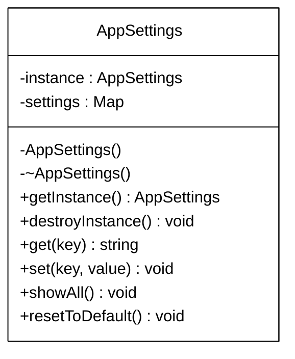

# Singleton (Одиночка)
Одиночка — это порождающий паттерн проектирования, который гарантирует, что у класса есть только один экземпляр, и предоставляет к нему глобальную точку доступа.

## Проблема
В приложении нужны общие настройки для всех модулей (тема, язык, шрифт). Если создавать объект настроек в каждом классе, они могут рассинхронизироваться. Если передавать объект вручную через все функции — это загрязняет код лишними зависимостями.

## Решение
Спрятать конструктор класса в private. Создать статический метод (getInstance), который будет возвращать один и тот же объект при каждом вызове. В данном примере также реализовано ручное управление временем жизни объекта через destroyInstance.

## UML Схема класса

## Особенности реализации на C++
* **Запрет копирования:** использованы = delete для конструктора копирования и оператора присваивания. Это защищает от случайного создания дубликата объекта.
* **Управление памятью:** так как объект создается через new, предусмотрен метод destroyInstance() для его корректного удаления, чтобы избежать утечек памяти.
* **Потокобезопасность:** данная реализация является классической, но не является потокобезопасной (thread-safe). Если getInstance() вызовется из двух потоков одновременно, могут создаться два объекта.
###
Примечание:
для продакшена на C++11 и выше рекомендуется использовать "Синглтон Мейерса" (объявление static AppSettings instance; внутри функции getInstance()), который гарантирует потокобезопасность на уровне компилятора.

## Плюсы
* Гарантирует единственный экземпляр настроек во всем приложении.
* Предоставляет глобальную точку доступа к объекту.
* Ленивая инициализация: объект создается только тогда, когда впервые к нему обращаются.

## Минусы
* Нарушает принцип единственной ответственности (SRP): класс контролирует и свое создание, и свою логику.
* Усложняет написание юнит-тестов (так как глобальное состояние сложно сбрасывать между тестами).
* Требует осторожности в многопоточной среде.

## Пример реализации
Вся реализация паттерна, включая класс и пример использования в main(), находится в одном файле:

* [Singleton.cpp](./Singleton.cpp)